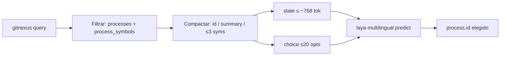

# Research — Serializar procesos de `query` como estado Laya

> **Ticket:** #193 (mapa #192) · **Rama throwaway:** `research/laya-serializar-estado` · **Fecha:** 2026-09-22 · **Autor:** agente research (Cursor)
> **Pregunta:** ¿Cómo serializar el resultado de `gitnexus query` (procesos + símbolos: name, filePath, summary) en un `state` de Laya que entre en el presupuesto multilingüe (~768 tokens de documento con ventana 1024), dejando sitio para un `choice` de ≤20 opciones, sin perder la señal que permite elegir el proceso correcto?
> **Repo:** `C:\Users\mauri\ProyectosOpencode\ModoOps` · **Laya local:** `.venv-win` `laya==0.3.6` · **Checkpoint esperado (mapa):** `laya-multilingual`

---

## 1. Resumen ejecutivo (TL;DR)

**No volcar el JSON crudo de MCP.** El payload completo de `query` (sobre todo `definitions[]` + ids largos + timing) explota el presupuesto (~3k tokens estimados con `chars/4` para un top-5×10 naive). La serialización correcta es un **documento compacto solo de candidatos a proceso**, con el mismo id en `state` y en `choice.criteria`, y el detalle discriminante (summary + 1–3 símbolos `name` + path corto) en el state.

| Pieza | Dónde vive | Cap recomendado | Presupuesto |
|---|---|---|---|
| Evidencia (procesos + símbolos) | `state` (texto o JSON compacto) | **≤10 procesos** (duro ≤20); **1–3 símbolos/proceso** | ~768 tok (`max_len - head_max_len`) |
| Pregunta de selección | `questions.process` tipo `choice` | **≤20 opciones**; key = `process.id`; value = summary corto | ~256 tok (`head_max_len`) |
| Descartar siempre | — | `definitions`, `timing`, `staleness`, `id` GraphQL-largo del símbolo, `startLine`/`endLine`, `module`, `process_type`, `include_content` | — |

**Formato recomendado (líneas, no JSON verboso):** cabe holgado en top-5×3 (~230 tok `chars/4`) y top-10×2 (~350); top-20×2 líneas ~704 (casi al techo); top-20×2 JSON ~849 (**se pasa**). Para el prototipo del mapa: `query(limit=5..10)` → state líneas → `choice` ≤N opciones con las mismas keys.

---

## 2. Fuentes primarias

### 2.1 Laya — presupuesto y forma de `state` / `choice`

| Claim | Fuente |
|---|---|
| `state` = texto, email, ticket **o JSON**; `predict(state, questions)` | [HF `laya-multilingual` README](https://huggingface.co/convaiinnovations/laya-multilingual/raw/main/README.md); [GitHub README](https://raw.githubusercontent.com/NandhaKishorM/laya/main/README.md) |
| Checkpoint multilingüe: context **1024**; **256** tokens a pregunta+opciones → **~768** al documento/state | HF README §Architecture (“Budget 1024 … 256 go to the question and its options”); GitHub README §Honest limits (`head_max_len = 256`, `max_len - head_max_len` ≈ 768) |
| Mantener `choice` **bajo ~20 opciones**; opciones comparten el head fijo | HF README §Limits; GitHub README (Banking77 / `head_max_len`) |
| PyPI vigente **0.3.6** (mismo texto de límites) | [pypi.org/pypi/laya](https://pypi.org/project/laya/) · instalado en `.venv-win` |
| No subir `head_max_len` en este mapa (out of scope fine-tune / tuning) | Issue #192 Out of scope + Notes (checkpoint `laya-multilingual` copy ES-AR) |

### 2.2 GitNexus `query` — shape real en ModoOps

Contrato MCP (tool `query`, repo `ModoOps`):

- Inputs relevantes: `search_query`, `goal`, `limit` (default **5**, max 100), `max_symbols` (default **10**, max 200), `include_content` (default false).
- Output agrupado:
  - `processes[]`: `id`, `summary`, `priority`, `symbol_count`, `process_type`, `step_count`
  - `process_symbols[]`: `id`, `name`, `filePath`, `startLine`, `endLine`, `module`, `process_id`, `step_index` (+ a veces `type`)
  - `definitions[]`: símbolos sueltos **fuera** de proceso (ruido frecuente para “elegir proceso”)
  - `timing`, `staleness` (metadatos de corrida, no señal de routing)

Confirmado en corrida live 2026-09-22 (`query({search_query:"pos discount", goal:"POS discount logic", repo:"ModoOps"})`): varios procesos con **summaries casi idénticos** (`Poll → ListShellCheckpoints`) y `definitions` con muchos hits de substring `pos` — la discriminación útil está en **símbolos + path**, no en el summary solo ni en `definitions`.

Baseline de tokens del contrato grafo (sin Laya): `docs/research/consumo-agente-tokens.md` §3.1; arquetipo exploratoria ~0.8k tokens de respuesta `query` agregada en `docs/research/trazas-ahorro-60-50.md` — eso es el techo del agente Cursor, **no** el techo de Laya. Laya necesita un **recorte** de esa respuesta.

### 2.3 Medición local de presupuesto (chars/4)

Script throwaway `.scratch/measure_laya_state_tokens.py` (no versionado). Tokenizer mmBERT del hub no instanció en esta máquina (`sentencepiece`/backend); se usa **chars/4** como proxy (el mapa #192 aún no fija tokenizer — ver Not yet specified).

| Caso | chars/4 (proxy) | ¿Cabe en ~768 state? | ¿Cabe en ~256 head? |
|---|---:|---|---|
| Compact lines top-5 × 3 syms | 229 | sí | — |
| Compact JSON top-5 × 3 | 278 | sí | — |
| Compact lines top-10 × 2 | 350 | sí | — |
| Compact lines top-20 × 2 | 704 | justo | — |
| Compact JSON top-20 × 2 | 849 | **no** | — |
| `choice` 5 opts (id→summary) | 67 | — | sí |
| `choice` 20 opts | 210 | — | justo |
| Naive MCP `processes`+`process_symbols` top-5×10 | 3302 | **no** | — |

---

## 3. Qué señal conservar (para no perder el proceso correcto)

El recortador debe permitir a Laya distinguir procesos cuando el ranking de `query` es ambiguo. Señal mínima viable, en orden:

1. **`process.id`** — key estable compartida entre state y `choice.criteria` (lo que el harness lee después).
2. **`process.summary`** — flujo `A → B` (texto corto que Laya matchea contra el goal).
3. **`priority`** (opcional, 1 decimal) — rompe empates blandos; barato.
4. **1–3 `process_symbols`**: `name` + **path corto** (últimos 2 segmentos del `filePath`) — es lo que separa procesos con el mismo summary.
5. **`goal` / `q`** del pedido del agente — ancla el `choice` al mismo lenguaje que usó `query`.

**No hace falta (y suele dañar):** `definitions[]`, ids `Function:path:name` completos, line ranges, `module`, `process_type`, `step_index`, source (`include_content`), timing/staleness.

Analogía: Laya es un portero que elige **una puerta entre ≤20**. El state es el plano de las puertas (qué hay detrás); el `choice` es la lista de números de puerta. Si metés el edificio entero (`definitions` + 50 símbolos), el plano no entra por la ventana de 768 tokens.

---

## 4. Contrato de serialización propuesto

### 4.1 Pipeline

```
query(limit≤10, max_symbols≤3, include_content=false)
  → drop definitions/timing/staleness
  → take top N processes (N≤20, prefer 5–10)
  → for each: keep id, summary, priority; attach ≤3 symbols {name, filePath_short}
  → state = compact lines (prefer) OR compact JSON if N≤10
  → choice.criteria[id] = summary (truncado ≤80 chars)
  → agent.predict(state, {"process": {type:"choice", instructions, criteria}})
```

### 4.2 Ejemplo de `state` (líneas)

```text
goal: POS discount logic
q: pos discount
procs:
1. proc_21_post_init_hook | Post_init_hook → _find | prio=0.116 steps=4
  - post_init_hook @ modoops_core/hooks.py
2. proc_140_poll | Poll → ListShellCheckpoints | prio=0.085 steps=6
  - listShellCheckpoints @ services/mo_shell_path.js
```

### 4.3 Ejemplo de `choice` alineado

```python
questions = {
    "process": {
        "type": "choice",
        "instructions": "Which process best matches goal given procs?",
        "criteria": {
            "proc_21_post_init_hook": "Post_init_hook → _find",
            "proc_140_poll": "Poll → ListShellCheckpoints",
            # … ≤20 keys, identical to state ids
        },
    }
}
```

### 4.4 Reglas de presupuesto (duras para el harness)

1. **N ≤ 20** procesos (límite de acierto documentado de Laya); default harness **N = min(limit_query, 10)**.
2. **State ≤ ~700 tokens proxy** (`chars/4` o tokenizer real cuando #192 lo fije) — margen para goal/q y truncado.
3. Si N×syms empuja >700: bajar a **1 símbolo/proceso** (el de menor `step_index` o el primero del payload) antes de subir `head_max_len`.
4. **Nunca** serializar `definitions` al state de Laya.
5. Path corto: `"/".join(filePath.split("/")[-2:])` — conserva carpeta + archivo sin el prefijo largo.
6. Copy ES-AR del `instructions` del choice es tema de #194 (checkpoint); este ticket solo fija la **forma** del state.

---

## 5. Incorrecto vs correcto

| Incorrecto | Correcto |
|---|---|
| `state = json.dumps(mcp_query_result)` | Filtrar → compactar → solo procesos candidatos |
| Meter 50 procesos y confiar en softmax | Cap ≤20; preferir top-5/10 del `query` |
| Choice con labels largos + state vacío | State con evidencia; choice con ids + summary corto |
| Confiar solo en `summary` cuando hay colisiones | Incluir `name` + path corto por proceso |
| Usar `definitions` como “más contexto” | Tratarlas como ruido de ranking; fuera del state |



---

## 6. Implicaciones para tickets del mapa #192

| Ticket | Qué desbloquea esta nota |
|---|---|
| #196 Arquetipos + etiquetas oro | Oro = `process.id` del compacto; el harness debe persistir el mismo id que entró al state |
| #197 Harness query→Laya→context | Implementar el serializer de §4; baseline = grafo sin Laya (`consumo-agente-tokens` / `trazas-ahorro-60-50`) |
| #194 Checkpoint ES-AR | No cambia el schema del state; puede acortar aún más summaries en ES-AR |

---

## 7. Límites honestos

- Proxy **chars/4**, no tokens mmBERT reales (tokenizer hub no instanció aquí). Re-medir con el tokenizer del checkpoint cuando #192 cierre el método de conteo.
- `query` live a veces devuelve procesos semánticamente flojos (staleness/index); el serializer no arregla recall — solo el presupuesto y la señal relativa entre candidatos.
- Multilingual zero-shot en typed-decisions es débil (README Laya); el prototipo mide **si el recorte ayuda al agente Cursor**, no si Laya sustituye a `context`/`impact`.

---

## 8. Respuesta en una frase

**Serializá solo el top-N (≤10 preferido, ≤20 duro) de `processes` + ≤3 símbolos por proceso (`name` + path corto + `summary`/`priority`), en texto compacto alineado 1:1 con un `choice` cuyas keys son los `process.id`, y tiré `definitions`/metadatos — así el state queda bajo ~768 tokens y el head de ≤20 opciones bajo ~256 sin perder la señal para elegir el proceso correcto.**
