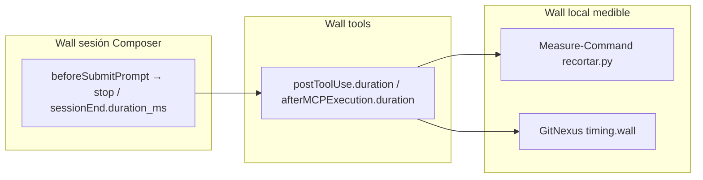

# Research — Medir tokens y wall-clock en sesión Cursor (con/sin Laya)

> **Ticket:** [#199](https://github.com/mauriciosoyastor/ModoOps/issues/199) (mapa [#198](https://github.com/mauriciosoyastor/ModoOps/issues/198)) · **Rama throwaway:** `research/medir-sesion-cursor-199` · **Fecha:** 2026-09-22 · **Autor:** agente research (Cursor)
> **Pregunta:** ¿Cómo medir, en este entorno (Cursor + ModoOps), **tokens estimados / tool calls** y **wall-clock** del flujo de exploración con y sin Laya, de forma reproducible y citada a fuentes primarias — **sin inventar métricas del IDE**?
> **Repo:** `C:\Users\mauri\ProyectosOpencode\ModoOps`
> **Alcance:** tooling del agente Cursor + Laya local. **No** Agente / Techo IA de producto. **No** implementar daemon ni cambiar la skill.

---

## 1. Resumen ejecutivo (TL;DR)

**Hoy se puede medir de forma reproducible un proxy de “tokens de herramienta” (`chars/4`), el conteo de tool calls, y el wall-clock por capas (Laya CLI, GitNexus `timing.wall`, duración de tools vía hooks).** No se puede afirmar tokens reales del modelo de una sesión IDE Composer sin un canal oficial (Admin API / OpenTelemetry Export, ambos **Enterprise**), y el hook `stop` documentado **no** publica tokens.

| Señal | Observable hoy sin Enterprise | Fuente primaria |
|---|---|---|
| Tokens proxy de payloads `query`/`context` | Sí — `chars/4` | `tools/laya/harness_recortador.py` (`tok`, docstring) |
| Tool calls por turno/sesión | Sí — transcripción JSONL y/o hooks `postToolUse` / `subagentStop.tool_call_count` | Logs locales agent-transcripts; [Hooks](https://cursor.com/docs/hooks) |
| Wall Laya one-shot | Sí — `Measure-Command` / reloj de proceso alrededor de `recortar.py` | CLI local (mapa #198 midió ~31 s cold-load en sesión de charting) |
| Wall GitNexus por query | Sí — campo `timing.wall` (ms) en la respuesta | MCP/CLI `query` (corrida 2026-09-22: `timing.wall` presente) |
| Wall por tool MCP/Shell | Sí — `duration` / `duration_ms` en hooks | [Hooks](https://cursor.com/docs/hooks) `postToolUse`, `afterMCPExecution`, `afterShellExecution` |
| Wall de sesión Composer | Sí — `sessionEnd.duration_ms` | [Hooks](https://cursor.com/docs/hooks) `sessionEnd` |
| Tokens reales input/output/cache del modelo (IDE) | Solo si hay **Enterprise** Admin API u OTel | [Admin API](https://cursor.com/docs/account/teams/admin-api); [OTel Export](https://cursor.com/docs/enterprise/opentelemetry-export) |
| Tokens por Cloud Agent run | Sí vía Cloud Agents API `/usage` (otro surface) | [Cloud Agents API](https://cursor.com/docs/cloud-agent/api/endpoints) |
| “Usage panel” / métrica inventada del IDE | **No** — no citar | — |

**Baselines del mapa #198 (obligatorios en el harness de sesión):**

- **A** = expandir **todos** los candidatos del `query` (mismo sentido que el harness actual).
- **B** = agente disciplinado **≤2 `context`** sin Laya (fallback de la skill; el que el usuario “siente”).

El harness offline ya mide **A vs Laya** en `chars/4` (PASS ciclo 3: 46.7% ahorro vs A). **No** mide B ni wall de sesión Cursor ([`laya-loop-aprendizaje.md`](./laya-loop-aprendizaje.md); [`PROTOTYPE.md`](../../tools/laya/PROTOTYPE.md)).

---

## 2. Fuentes primarias consultadas

### 2.1 Locales (ModoOps)

| Artefacto | Qué aporta |
|---|---|
| `tools/laya/harness_recortador.py` | Proxy `tok()` = `len(json)//4`; baseline = `query` + `context` de **todos** los candidatos; Laya = `query` + 1–2 contexts; unidad `token_unit: "chars/4"` en `harness_last_run.json` |
| `tools/laya/PROTOTYPE.md` | Contrato one-shot / harness; umbrales hits/ahorro del mapa #192 |
| `docs/research/laya-serializar-estado-193.md` | Mismo proxy `chars/4` hasta fijar tokenizer; descartar `timing` del payload para state Laya |
| `docs/research/trazas-ahorro-60-50.md` | Metodología previa: conteo de tool calls + tokens **estimados** (opencode); no es medidor Cursor |
| `docs/research/consumo-agente-tokens.md` | Contrato grafo vs grep; no wall ni sesión IDE |
| `docs/research/laya-loop-aprendizaje.md` | Explicitá: éxito = harness; **fuera** “hook/skill en sesión Cursor” |
| Skill `.agents/skills/laya-recortador/SKILL.md` | Fallback B: sin Laya → máx. 2 `context` |
| Issue [#198](https://github.com/mauriciosoyastor/ModoOps/issues/198) | Destination: medir wall (daemon) y tokens vs A y B |
| Issue [#199](https://github.com/mauriciosoyastor/ModoOps/issues/199) | Esta pregunta |

### 2.2 Cursor (docs oficiales)

| Doc | Qué aporta a #199 |
|---|---|
| [Hooks](https://cursor.com/docs/hooks) | Duraciones por tool/MCP/shell; `sessionEnd.duration_ms`; `subagentStop.tool_call_count`; `preCompact.context_tokens` (ventana, no gasto del turno); schema `stop` = `status` + `loop_count` (**sin** campos de tokens) |
| [OpenTelemetry Export](https://cursor.com/docs/enterprise/opentelemetry-export) + [Wire](https://cursor.com/docs/enterprise/opentelemetry-export/wire) | Tokens reales en logs `cursor.api.request.*_tokens`; tool calls como **métrica agregada** sin `conversation.id`; Enterprise |
| [Admin API](https://cursor.com/docs/account/teams/admin-api) | `POST /teams/filtered-usage-events` con `tokenUsage` + `conversationId`; **Enterprise only** ([APIs overview](https://cursor.com/docs/api)) |
| [Cloud Agents API — usage](https://cursor.com/docs/cloud-agent/api/endpoints) | `inputTokens`/`outputTokens`/cache por run — **Cloud Agents**, no Composer IDE local |
| [APIs overview](https://cursor.com/docs/api) | Admin/Analytics/OTel-style team APIs = Enterprise; Cloud Agents = all plans (otro surface) |

### 2.3 GitNexus (respuesta live)

Corrida MCP `query` 2026-09-22 (`search_query: "pos discount"`, `repo: "ModoOps"`) devolvió bloque:

```json
"timing": {
  "vector": 169.3,
  "bm25": 692.2,
  "merge": 0.1,
  "symbol_lookup": 36.2,
  "ranking": 0,
  "formatting": 0,
  "wall": 728.6
}
```

Unidades: milisegundos de la corrida del servidor/CLI (no incluyen cold-load de Laya ni latencia del modelo Cursor). El schema MCP de `query` también admite `maxTokens` (tope de respuesta formateada) — útil para acotar payload, **no** es un medidor de tokens del LLM.

---

## 3. Qué se puede observar hoy (detalle)

### 3.1 Tokens estimados — proxy `chars/4` (contrato del mapa)

Definición en código (`tools/laya/harness_recortador.py`):

```python
def tok(obj) -> int:
    """Proxy chars/4 — same as research #193 until tokenizer is locked."""
    ...
    return max(1, len(raw) // 4)
```

Docstring del módulo: *“Tokens = chars/4 of tool JSON payloads (Cursor-agent proxy).”*

Qué cuenta el harness como “tokens del agente” (no del modelo):

| Condición | Suma |
|---|---|
| Baseline **A** | `tok(query.processes + process_symbols)` + Σ `tok(context)` de **cada** candidato |
| Con Laya | `tok(query…)` + Σ `tok(context)` de los 1–2 `expand` (el `state` Laya es opcional / Laya-only) |

Evidencia de corrida: `tools/laya/harness_last_run.json` → `"token_unit": "chars/4"`, `baseline_tokens` vs `laya_agent_tokens`, `marginal_savings`.

**Cómo usarlo en sesión real:** tras cada tool relevante (`query`, `context`, salida de `recortar.py --json`), persistir el JSON de salida y aplicar la misma `tok()`. Eso hace comparable sesión ↔ harness. **No** confundir con tokens de facturación del modelo.

### 3.2 Tool calls

Fuentes observables sin Enterprise:

1. **Transcripciones del agente** (Cursor escribe JSONL por conversación bajo el proyecto `agent-transcripts`). Cada `tool_use` / invocación MCP es un evento contable. Reproducible: misma pregunta → contar llamadas `query`/`context`/`Shell`(recortar)/`Read`.
2. **Hooks** ([docs](https://cursor.com/docs/hooks)):
   - `postToolUse` / `postToolUseFailure`: un evento por tool (con `tool_name`, `duration`).
   - `afterMCPExecution`: duración MCP.
   - `subagentStop.tool_call_count`: total de calls del subagente (si el flujo usa Task).
3. **Metodología histórica** en `trazas-ahorro-60-50.md`: conteo manual de calls por arquetipo (A grep vs B grafo). Sirve de plantilla de tabla, no de medidor automático Cursor.

Para el mapa: definir el set de tools “en scope” (p. ej. solo `query` + `context` + Shell del recortador) y reportar **N_calls_in_scope** además del total de la sesión (el total incluye ruido: GetDynamicTools, status, etc.).

### 3.3 Wall-clock — tres capas (no mezclar)



| Capa | Cómo medir | Incluye |
|---|---|---|
| **Laya CLI** | `Measure-Command { python tools/laya/recortar.py … }` (PowerShell) o equivalente | Cold-load modelo + `query` interno + predict |
| **GitNexus** | `timing.wall` del payload `query`/`context` | Solo motor grafo |
| **Tool hook** | `duration` de Shell/MCP | Aprobaciones de usuario **excluidas** en shell/MCP según docs (`excludes approval wait time`) |
| **Sesión** | `sessionEnd.duration_ms` o Δt `beforeSubmitPrompt`→`stop` (timestamp local del harness de hooks) | Pensamiento del modelo + tools + UI |

El mapa #198 documentó en Notes que la skill one-shot suma **~31 s cold-load** — eso es wall de capa Laya, **no** ahorro de tokens del LLM.

### 3.4 Señales Cursor que *no* son “tokens del turno”

- **`preCompact.context_tokens` / `context_usage_percent`**: tamaño de ventana en el momento del compact ([Hooks](https://cursor.com/docs/hooks)). Útil para detectar presión de contexto; no es el gasto atribuible a A vs B vs Laya.
- **`cursor.tool.calls` (OTel)**: agregados org-wide; **sin** `conversation.id` ([OTel](https://cursor.com/docs/enterprise/opentelemetry-export)).
- **Cloud Agents `/usage`**: tokens reales, pero otro producto surface ([Cloud Agents API](https://cursor.com/docs/cloud-agent/api/endpoints)).

### 3.5 Tokens reales del modelo (opcional / Enterprise)

Si el equipo ModoOps tiene plan Enterprise y API key Admin:

1. Correr la sesión de medición; anotar `conversation_id` / composer UUID (`sessionStart.session_id` = conversation id, [Hooks](https://cursor.com/docs/hooks)).
2. `POST https://api.cursor.com/teams/filtered-usage-events` y sumar `tokenUsage.*` donde `conversationId` coincide ([Admin API](https://cursor.com/docs/account/teams/admin-api)).
3. Alternativa: OTel → sumar `cursor.api.request.input_tokens` + `output_tokens` (+ cache) agrupado por `cursor.conversation.id` ([OTel joining sessions](https://cursor.com/docs/enterprise/opentelemetry-export)).

Si **no** hay Enterprise: declarar en el informe `tokens_modelo: N/A (no Enterprise)` y usar solo `chars/4` + tool calls + walls. **No inventar** un número del UI.

El schema oficial del hook **`stop`** solo documenta `status` y `loop_count` ([Hooks](https://cursor.com/docs/hooks) §stop). No usarlo como fuente de tokens.

---

## 4. Qué no se puede (hoy, en este entorno típico)

| Claim | Por qué no |
|---|---|
| “Cursor me muestra X tokens de esta exploración” sin Admin/OTel | No hay doc pública de métrica per-turn en Composer IDE para planes no-Enterprise |
| Tokens reales del modelo vía hook `stop` | Schema oficial sin campos de tokens |
| Tool-call rate OTel atribuido a una sesión | Métrica sin `conversation.id` |
| Export de contenido de conversación IDE | `conversation_content` OTel: Cloud Agents y Grok Bot only; IDE/CLI/desktop “not on this family yet” |
| Igualar `chars/4` a tokens del proveedor | Proxy explícito (#193 / harness); tokenizer del checkpoint no es el del LLM Cursor |
| Wall del harness offline = wall de sesión | El harness no incluye latencia del agente ni cold-load en el loop del chat |
| Ahorro del harness vs A = ahorro vs B | B ya limita a ≤2 context; el PASS 46.7% es vs A |

---

## 5. Protocolo mínimo — “session harness” (mapa #198)

Objetivo: una corrida reproducible que produzca una fila comparable para **A**, **B** y **Laya** (o prototipos #202/#203), sin daemon (#200) ni umbrales finales (#201).

### 5.1 Preparación (una vez)

1. Fijar **modelo** y modo Composer (`agent`) — anotar en la hoja.
2. Índice GitNexus sano: `npx gitnexus doctor` (o status) — mismo prerequisito que `trazas-ahorro-60-50.md`.
3. Arquetipos: reutilizar `tools/laya/archetypes.json` (mismos `query`/`goal`/`gold_*`) para alinear con el harness offline.
4. (Opcional) Hook mínimo que append-e JSONL: `beforeSubmitPrompt`, `postToolUse`, `afterMCPExecution`, `afterShellExecution`, `stop`, `sessionEnd` → archivo `.scratch/session-harness/<run_id>.jsonl` (no versionar secretos).
5. (Opcional Enterprise) API key Admin lista para join por `conversationId`.

### 5.2 Condiciones (3 chats frescos, mismo prompt de usuario)

Prompt canónico (ejemplo):

> Explorá con GitNexus: query=`<q>` goal=`<g>`. Respondé dónde está el oro. **No edites código.**

| Condición | Instrucción al agente (system/skill o mensaje) |
|---|---|
| **A — expand-all** | Tras `query`, abrí `context` de **cada** proceso candidato (hasta el `limit` del query, tip. 10). Sin Laya. |
| **B — disciplinado** | Tras `query`, abrí **como máximo 2** `context` (mejor summary/símbolo vs goal). Sin Laya. |
| **Laya** | Seguí skill `laya-recortador`: `recortar.py` → solo `context` de `expand[]`. |

Una condición = **un** composer nuevo (evita contaminación de contexto). Misma pregunta de usuario.

### 5.3 Métricas a registrar (por condición × arquetipo)

| Campo | Cómo | Unidad |
|---|---|---|
| `run_id` | UUID / timestamp | — |
| `condition` | `A` \| `B` \| `laya` | — |
| `archetype_id` | de `archetypes.json` | — |
| `hit` | ¿apareció `gold_symbol@gold_file` en algún `context` abierto? | bool |
| `n_context_calls` | conteo de tools `context` (MCP o CLI) | int |
| `n_query_calls` | conteo `query` | int |
| `n_laya_shell` | conteo Shell a `recortar.py` | int |
| `tool_calls_in_scope` | suma anterior (+ Grep/Read si se usan) | int |
| `tokens_proxy_query` | `chars/4` del payload query usado | int |
| `tokens_proxy_contexts` | Σ `chars/4` de cada context abierto | int |
| `tokens_proxy_agent` | query + contexts (igual fórmula harness) | int |
| `wall_laya_ms` | solo condición Laya: Measure-Command / duración Shell hook | ms |
| `wall_gitnexus_query_ms` | `timing.wall` del query | ms |
| `wall_tools_sum_ms` | Σ `duration` hooks de tools in-scope | ms |
| `wall_session_ms` | `sessionEnd.duration_ms` o Δt prompt→stop | ms |
| `tokens_model_*` | Admin/OTel si disponible; else `null` | int \| null |
| `notes` | compactación, errores, skipped expand | texto |

Comparaciones a reportar:

- **Ahorro tokens proxy vs A:** `(tok_A - tok_X) / tok_A` para X ∈ {B, Laya}.
- **Ahorro tokens proxy vs B:** `(tok_B - tok_Laya) / tok_B` (si ≤0, Laya no gana al agente disciplinado).
- **Overhead wall Laya:** `wall_laya_ms` y/o `wall_session_Laya - wall_session_B`.
- **Calls:** `tool_calls_in_scope` A vs B vs Laya.

### 5.4 Reproducibilidad

- ≥ **1** pasada completa de los 5 arquetipos × 3 condiciones (15 sesiones) para el primer informe; ideal 2 pasadas si hay ruido.
- No mezclar ediciones de código en la sesión de medición.
- Guardar: hoja CSV/JSON + path a transcript UUID + (si hay) `conversationId`.
- Separar **cold** vs **warm** Laya: hasta que exista daemon (#200), etiquetar toda corrida one-shot como `laya_cold`.

### 5.5 Qué queda fuera de este protocolo (otros tickets)

| Ticket | Relación |
|---|---|
| #200 Daemon keep-warm | Cambia `wall_laya_ms`; este protocolo ya reserva el campo |
| #201 Umbrales pass/fail | Consume las filas de este harness |
| #202 / #203 Prototipos | Usan la misma hoja con `condition` distinta |
| Implementar hooks en el repo | Este research **no** los implementa; solo define el contrato |

---

## 6. Analogía

Medir el recortador solo con el harness offline es como cronometrar un atajo en el mapa de papel y luego quejarse de que el GPS tarda en encender: el mapa (#192) demostró que el **camino corto existe** (`chars/4` vs A); la sesión Cursor agrega el tiempo de **arrancar el GPS** (~31 s cold) y compara contra un conductor que **ya no toma el camino largo** (baseline B). El session harness de arriba mide las tres cosas por separado para no confundir “ahorro en el papel” con “más rápido en la calle”.

---

## 7. Respuesta directa al ticket #199

**¿Cómo medir?**

1. **Tokens estimados:** misma unidad que el harness — `chars/4` de payloads `query` + `context` abiertos; opcionalmente tokens reales del modelo **solo** vía Admin API / OTel Enterprise.
2. **Tool calls:** contar desde transcript y/o hooks `postToolUse` / `subagentStop`, filtrando in-scope.
3. **Wall-clock:** capas separadas — Laya (`Measure-Command`/Shell duration), GitNexus (`timing.wall`), tools (hooks), sesión (`sessionEnd` o Δt prompt→stop).
4. **Protocolo:** 3 condiciones A/B/Laya × arquetipos fijos; hoja §5.3; no inventar métricas del IDE.

**¿Qué no?** Tokens del modelo desde UI/hook `stop`; afirmar ahorro vs B sin medirlo; mezclar cold-load Laya con `timing.wall` de GitNexus.

---

## 8. Apéndice — referencias rápidas

- Harness: `tools/laya/harness_recortador.py:51-57` (`tok`), `:340-371` (baseline vs laya totals), `harness_last_run.json` (`token_unit`).
- Skill fallback B: `.agents/skills/laya-recortador/SKILL.md` §Fallback.
- Trazas calls/tokens (opencode): `docs/research/trazas-ahorro-60-50.md`.
- Cursor Hooks: https://cursor.com/docs/hooks
- Cursor OTel: https://cursor.com/docs/enterprise/opentelemetry-export
- Cursor Admin usage events: https://cursor.com/docs/account/teams/admin-api
- Cursor APIs availability: https://cursor.com/docs/api
)
