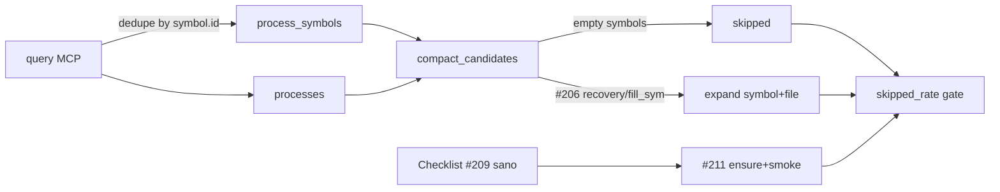

# Research — Por qué `query` trae `processes` sin `process_symbols` útiles

> **Ticket:** #209 (mapa #207) · **Rama:** `research/process-symbols-query-209` · **Fecha:** 2026-09-22 · **Autor:** agente research (Cursor)
> **Pregunta:** ¿Por qué un `query` GitNexus en ModoOps a veces devuelve `processes` sin `process_symbols` útiles, y cómo reproducir / checklistar un payload sano para el Recortador Laya? Causas: stale, `.gitnexusignore`, lenguajes/parseo, limit, degradación exact-scan, etc. Fuentes primarias + probes locales.
> **Relacionado:** #206 (serialización compacta / `skipped`); Laya `tools/laya/harness_recortador.py` → `compact_candidates`.
> **Repo:** `C:\Users\mauri\ProyectosOpencode\ModoOps` · **CLI/MCP:** `gitnexus@1.6.10` · **Index:** commit `f1774c9` (6 commits behind HEAD al momento del probe) · **doctor:** graph/fts/vector **available**, Semantic mode **vector-index**, embeddings **2886**, dims **384**.

---

## 1. Resumen ejecutivo (TL;DR)

**Causa principal (reproducible hoy en ModoOps):** el backend de `query` arma `process_symbols` por proceso y **después deduplica por `symbol.id`**. Si el mismo nodo (p. ej. `OdooAdapter`, `_es_candidato`, `listShellCheckpoints`) participa en varios procesos vía `STEP_IN_PROCESS`, solo **un** `process_id` conserva la fila; el resto de `processes[]` queda con `symbol_count ≥ 1` pero **sin filas** en `process_symbols` con ese `process_id`.

Para el Recortador eso se traduce en `compact_candidates` → `symbols: []` → `expand` / `primary_for_pid` → `skipped: true` (mitigado parcialmente por #206: recovery por nombre en summary + `_expand_with_symbol_fill`).

Otras causas reales pero secundarias: índice stale, FTS/vector en exact-scan o unavailable, hits solo en `definitions` (símbolos sin proceso), `limit`/`max_symbols` bajos, ignore agresivo, lenguajes no parseados, y truncado MCP por `maxTokens`.

**Payload “sano” para Laya:** doctor en paridad + freshness aceptable + ≥1 símbolo con `name`+`filePath` **por** proceso que se vaya a expandir (attach rate ≥80% del top-N), sin depender solo de `definitions` ni de `symbol_count` del process (ese campo miente post-dedupe).

---

## 2. Contrato real de `query` (fuentes primarias)

### 2.1 Docs oficiales

| Claim | Fuente |
|---|---|
| `query` = híbrido BM25 + vector, RRF; agrupa por process | [Mintlify `query`](https://abhigyanpatwari-gitnexus.mintlify.app/api/tools/query) |
| Respuesta: `processes` + `process_symbols` + `definitions` | Misma doc §Response |
| `limit` = max processes; `max_symbols` = max symbols **per process** | Misma doc §Parameters; MCP schema `user-gitnexus` / `tools.js` |
| Processes = flujos entry→terminal; membership vía grafo | [Processes and flows](https://abhigyanpatwari-gitnexus.mintlify.app/concepts/processes-and-flows) |

### 2.2 Implementación `LocalBackend.query` (`gitnexus@1.6.10`)

Pipeline (comentarios del propio código):

1. Hybrid search BM25 ∥ semantic → merge RRF → slice `searchLimit = limit * max_symbols`.
2. Para cada hit con `nodeId`: lookup `STEP_IN_PROCESS` → agrega a `processMap[pid].symbols` (o a `definitions` si no hay proceso).
3. Rank + slice top `limit` processes.
4. Flatten symbols (`slice(0, max_symbols)` por proceso) → **dedupe por `s.id`** → `process_symbols`.

Fuente: `node_modules/gitnexus/dist/mcp/local/local-backend.js` ~1935–2392 (instalación global `1.6.10`).

Fragmento crítico (dedupe):

```js
// Deduplicate process_symbols by id
const seen = new Set();
const dedupedSymbols = processSymbols.filter((s) => {
  if (seen.has(s.id)) return false;
  seen.add(s.id);
  return true;
});
```

`symbol_count` en `processes[]` se calcula **antes** del dedupe (`p.symbols.length`). Por eso es normal ver:

| Campo | Valor engañoso |
|---|---|
| `processes[i].symbol_count` | `1` (o más) |
| filas en `process_symbols` con `process_id == processes[i].id` | `0` |

### 2.3 Consumidor Laya (ModoOps)

| Pieza | Comportamiento | Fuente |
|---|---|---|
| `compact_candidates` | Agrupa `process_symbols` por `process_id`; si vacío, recovery por nombre ∈ summary/id (#206) | `tools/laya/harness_recortador.py:98-139` |
| `expand_contexts` / `primary_for_pid` | Sin attach → `skipped: True` | `harness_recortador.py:162-177`, `recortar.py:25-38` |
| Daemon fill | `_expand_with_symbol_fill` reemplaza peers vacíos por candidatos con símbolo (`+fill_sym`) | `tools/laya/daemon_http.py:67-117` · resolución #206 |
| Gate pack | `skipped_rate ≤ 0.20` en `measure_grafo_v2.py` | ticket #206 / `measure_grafo_v2_last.json` (`skipped_rate: 0.0`) |

**#206 no arregla el dedupe upstream:** magrea el síntoma para que el expand del Recortador no falle el pack. Un checklist de “GitNexus sano” (#207 / #210) debe medir attach **antes** del fill.

---

## 3. Probes locales (2026-09-22, read-only)

### 3.1 Entorno

```
npx gitnexus doctor
  Graph store:      available
  Full-text search: available
  VECTOR index:     available
  Semantic mode:    vector-index
  embeddingDims:    384
  stats:            files 463, nodes 4477, processes 312, embeddings 2886
```

`gitnexus://repo/ModoOps/context`: **⚠️ Index is 6 commits behind HEAD.**

`.gitnexusignore` actual: solo `web/public/prototype/vendor/` (blobs Three.js).

### 3.2 Caso A — hub compartido (síntoma claro)

`query({search_query:"tenant login authentication", limit:3, repo:"ModoOps"})`:

- 3 processes (`proc_123_fetchtenantstate`, `proc_160_post`, `proc_186_post`), cada uno `symbol_count: 1`.
- **1** sola fila en `process_symbols` (`OdooAdapter` → solo `proc_123_…`).
- Attach rate = **1/3**.

Cypher confirma multi-membership del mismo `sid`:

```
MATCH (n)-[r:CodeRelation {type:'STEP_IN_PROCESS'}]->(p:Process)
WHERE n.name = 'OdooAdapter'
RETURN n.id, p.id, p.heuristicLabel
→ 7 procesos distintos, mismo Class:…:OdooAdapter
```

Misma forma con query basura semántica (`xyzzy nonexistent…`): 3 processes terminales en `_es_candidato`, **1** symbol row.

### 3.3 Caso B — `pos discount` (attach parcial)

4 processes; 2 `process_symbols` (`post_init_hook` + `listShellCheckpoints`). Dos processes con summary `… → ListShellCheckpoints` quedan sin fila propia (mismo id de símbolo compartido). Attach **2/4**. Muchos hits útiles del descuento POS viven en `definitions` (no tienen `STEP_IN_PROCESS`) → el Recortador **no** los usa para expand.

### 3.4 Reproducir el fallo en un checklist

```text
1. npx gitnexus doctor          # fts+vector available
2. MCP/CLI query con repo=ModoOps, limit=3..5
   search_query: "tenant login"  (o cualquier hub: OdooAdapter / ListShellCheckpoints)
3. Para cada p in processes:
     n = count(s in process_symbols where s.process_id == p.id)
4. FAIL si n==0 y se espera expand de ese process
5. Opcional: cypher STEP_IN_PROCESS del symbol.name del summary terminal
```

---

## 4. Catálogo de causas (prioridad)

| # | Causa | Efecto en payload | Cómo detectar | Mitigación |
|---|---|---|---|---|
| **1** | **Dedupe `process_symbols` por `symbol.id`** | Processes rankeados sin filas attach; `symbol_count` miente | Attach rate &lt; 1; hubs en cypher | Upstream: dedupe por `(id, process_id)` o clonar fila por proceso. Downstream (#206): recovery/fill_sym |
| **2** | Hits solo en `definitions` (sin `STEP_IN_PROCESS`) | `processes=[]` o processes irrelevantes + defs ricas | defs llenas, processes pobres / off-topic | Reindex si stale; no mezclar defs en Laya state (`docs/research/laya-serializar-estado-193.md`) |
| **3** | Índice **stale** | Flujos viejos / símbolos nuevos ausentes | `staleness.commitsBehind`; meta `lastCommit` ≠ HEAD | `npx gitnexus analyze` (+ `--embeddings` si dims/capa) — mapa #208/#210 |
| **4** | **FTS / vector unavailable** → exact-scan o solo una pista | Ranking degradado; histórico `pos discount` → 0 processes | `doctor` Semantic mode; warning `ftsDegraded` / `partial` | Extensiones Ladybug + OpenSSL/VC++ (ver `docs/research/brecha-vector-fts.md`); hoy ModoOps ya en vector-index |
| **5** | `limit` / `max_symbols` muy bajos | Pocas filas; hubs monopolizan el cupo | Comparar con limit≥5, max_symbols≥5 | Defaults 5/10; no bajar en smoke Laya |
| **6** | `maxTokens` / `GITNEXUS_MCP_DEFAULT_MAX_TOKENS` | JSON truncado mid-array (`…`) | Respuesta corta + marker | Subir budget o CLI `gitnexus query` (sin budget MCP) |
| **7** | `.gitnexusignore` / `.gitignore` | Archivos fuera del grafo → menos procesos | Diff files indexed vs tree | Ignorar solo vendor/ruido (hoy: prototype vendor) |
| **8** | Lenguaje / parser | CSS, markdown, assets, Astro frontmatter: pocos símbolos ejecutables | `query` conceptual → solo defs/filas File | Esperado; no es “índice roto” |
| **9** | Enrichment parcial (`STEP_IN_PROCESS` query falla) | `partial: true` + warning | Flag en respuesta | Reabrir DB / reanalyze; no tratar como clean |
| **10** | Multi-repo CLI sin `--repo` | Error, no payload | CLI falla | Siempre `repo: ModoOps` en esta máquina |

---

## 5. Checklist “payload sano” (Recortador / mapa #207)

Usar **antes** de confiar en `measure_grafo_v2` o en smoke #211.

### 5.1 Infra (doctor + meta)

- [ ] `graph: available`
- [ ] `fts: available` (no `extension-unavailable`)
- [ ] `vectorSearch` / Semantic mode: **`vector-index`** (no `exact-scan` salvo spike documentado)
- [ ] `embeddingDims == 384` (paridad ModoOps)
- [ ] `stats.embeddings > 0` y coherente con nodos (hoy 2886/4477)
- [ ] `incomplete_reasons: []` en resource context
- [ ] Freshness: `commitsBehind` en SLA del mapa #210 (hoy: 6 — **no** “perfecto”, pero query sigue útil)

### 5.2 Shape de un `query` de smoke

Arquetipos sugeridos (pack Laya / AGENTS):

| Arquetipo | `search_query` / goal | Expectativa |
|---|---|---|
| Auth/tenant | `tenant login` / gate BFF | ≥1 process; attach ≥1; Ojo hubs `OdooAdapter` |
| POS | `pos discount` / descuento | Preferir processes con symbols en `mo_pos_*`; defs no cuentan |
| Explorar tooling | `laya recortar` / harness | Process en `tools/laya/*` con `filePath` usable |

Checks por respuesta:

- [ ] `processes.length ≥ 1` (salvo query deliberadamente vacía)
- [ ] **Attach rate** = `|{p : ∃ s.process_id=p.id}| / |processes|` ≥ **0.8** para el top-N que Laya va a elegir (o documentar hubs)
- [ ] Cada símbolo a expandir tiene `name` **y** `filePath` no vacío (contrato #206)
- [ ] No hay `partial: true` ni warning FTS/vector-width/CJK drift
- [ ] No truncado MCP (`…` al final del JSON)
- [ ] `definitions` **no** se cuentan como attach (Laya las descarta en state)

Script mental (o assert en smoke #211):

```python
procs = payload["processes"]
syms = payload.get("process_symbols") or []
by = {s["process_id"] for s in syms if s.get("process_id")}
attach = sum(1 for p in procs if p["id"] in by) / max(len(procs), 1)
assert attach >= 0.8, (attach, [(p["id"], p["symbol_count"]) for p in procs])
# OJO: p["symbol_count"] puede ser >0 con attach 0 — no usarlo como gate
```

### 5.3 Relación #206 → #209 → #210/#211



- **#209** (este doc): por qué el payload llega “cojo” y cómo medirlo en la fuente.
- **#206** (cerrado): parches en Laya para que el pack no muera con hubs compartidos.
- **#210/#211**: SLA de reindex + ensure/smoke deben assertar **attach rate**, no solo `processes.length` ni `skipped_rate` post-fill.

---

## 6. Recomendaciones para el mapa #207

1. **Contrato medible:** `attach_rate(top_n) ≥ 0.8` + doctor paridad + freshness SLA — además de “hay processes”.
2. **No confiar en `symbol_count`** del process para gates.
3. **Upstream (issue GitNexus):** dedupe debe ser `(symbol.id, process_id)` o emitir una copia por proceso; el dedupe actual optimiza tokens pero rompe consumers que joinean por `process_id` (Laya, eval-server).
4. **Smoke #211:** incluir arquetipo hub (`tenant login`) **y** arquetipo con symbols distintos por process; reportar attach pre-fill y skipped post-fill.
5. **Stale:** notify/ensure (#208) evita defs/procesos fantasma; no explica el caso OdooAdapter con índice fresco.

---

## 7. Fuentes citadas

| Fuente | Uso |
|---|---|
| https://abhigyanpatwari-gitnexus.mintlify.app/api/tools/query | Contrato tool |
| https://abhigyanpatwari-gitnexus.mintlify.app/concepts/processes-and-flows | Modelo process |
| `gitnexus@1.6.10` `dist/mcp/local/local-backend.js` `query()` | Dedupe + pipeline |
| `gitnexus@1.6.10` `dist/mcp/output-budget.js` | Truncado `maxTokens` |
| MCP resource `gitnexus://repo/ModoOps/context` + `npx gitnexus doctor` | Estado local |
| `.gitnexus/meta.json` | stats/capabilities/embeddings |
| `.gitnexusignore` | Scope de index |
| `tools/laya/harness_recortador.py`, `daemon_http.py`, `recortar.py` | Consumo / skipped |
| Issue #206 resolution comment | fill_sym / skipped_rate 0 |
| `docs/research/brecha-vector-fts.md`, `laya-serializar-estado-193.md`, `consumo-agente-tokens.md` | Contexto ModoOps |

---

## 8. Veredicto

Un `query` “con processes” **no** implica payload útil para Laya. En ModoOps, el fallo más frecuente y reproducible con índice sano (fts+vector) es el **dedupe por id de símbolo compartido entre procesos**. Checklist sano = doctor paridad + attach por `process_id` + `name`/`filePath` + sin `partial`/truncado; #206 es red de seguridad, no definición de salud del índice.
